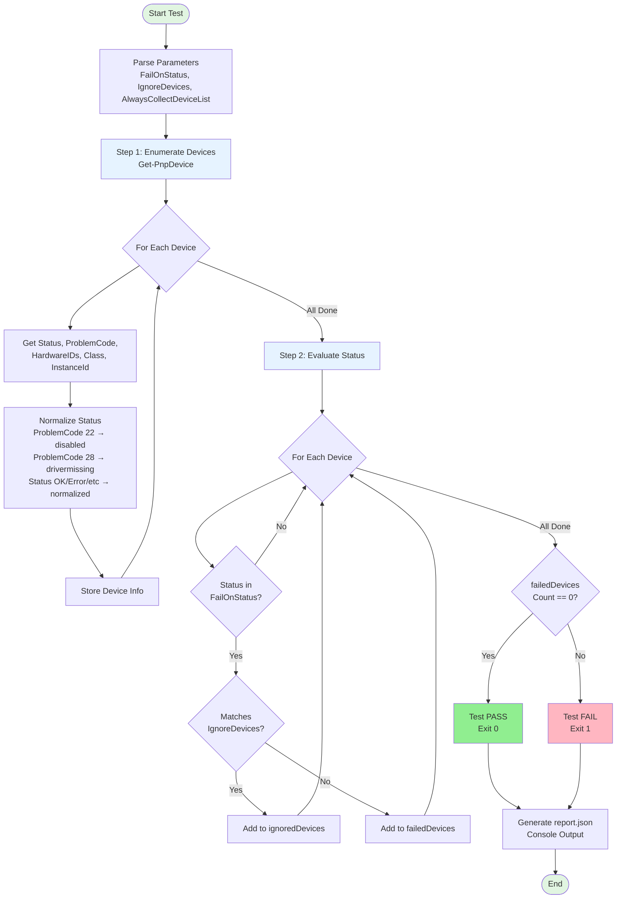

# Device Manager Status Check

## Purpose
Validates that all devices in Windows Device Manager are in a healthy state, failing if any device exhibits specified abnormal statuses (unless ignored via IgnoreDevices rules).

## Test Flow



## Test Logic
- **Step 1 – Enumerate Devices:** Uses `Get-PnpDevice` to enumerate all PnP devices from Device Manager.
- **Step 2 – Map Status:** Maps each device's native status to normalized categories: OK, Error, Disabled, Unknown, NotStarted, DriverMissing.
- **Step 3 – Apply Ignore Rules:** Filters out devices matching any ignore rule (AND logic within rule, OR logic across rules).
- **Step 4 – Evaluate:** If any non-ignored device matches `FailOnStatus`, test fails; otherwise passes.
- **Evidence:** Failed devices are always reported. Full device list is reported on failure or when `AlwaysCollectDeviceList=true`.

## Parameters
- `FailOnStatus` (json array, optional, default `["Error"]`): Which statuses trigger failure. Options: Error, Disabled, Unknown, NotStarted, DriverMissing.
- `IgnoreDevices` (json array, optional, default `[]`): Rules to ignore known issues. Each rule is an object with optional fields: `device_name`, `hardware_id`, `class`, `status`, `note`. Supports wildcard matching (`*`).
- `AlwaysCollectDeviceList` (boolean, optional, default `false`): Force full device snapshot even on pass.

## How to Run Manually

```powershell
pwsh ./run.ps1 -FailOnStatus '["Error", "Disabled"]' -IgnoreDevices '[]' -AlwaysCollectDeviceList:$false
```

## Expected Result
- **Pass:** No devices match `FailOnStatus`, or all matching devices are ignored.
- **Fail:** At least one device matches `FailOnStatus` and is not ignored. Console and report.json will list failed devices with details.

```
==================================================
TEST: case.hw.devmgr.core.status_check  RESULT: PASS  EXIT: 0
UTC:  2026-01-19T12:00:00Z
--------------------------------------------------
[1/2] enumerate_devices ................... PASS
[2/2] evaluate_device_status .............. PASS
--------------------------------------------------
      total_devices=142 failed_devices=0 ignored=0
--------------------------------------------------
STEPS: total=2  pass=2  fail=0  skip=0
MACHINE: overall=PASS exit_code=0
==================================================
```
