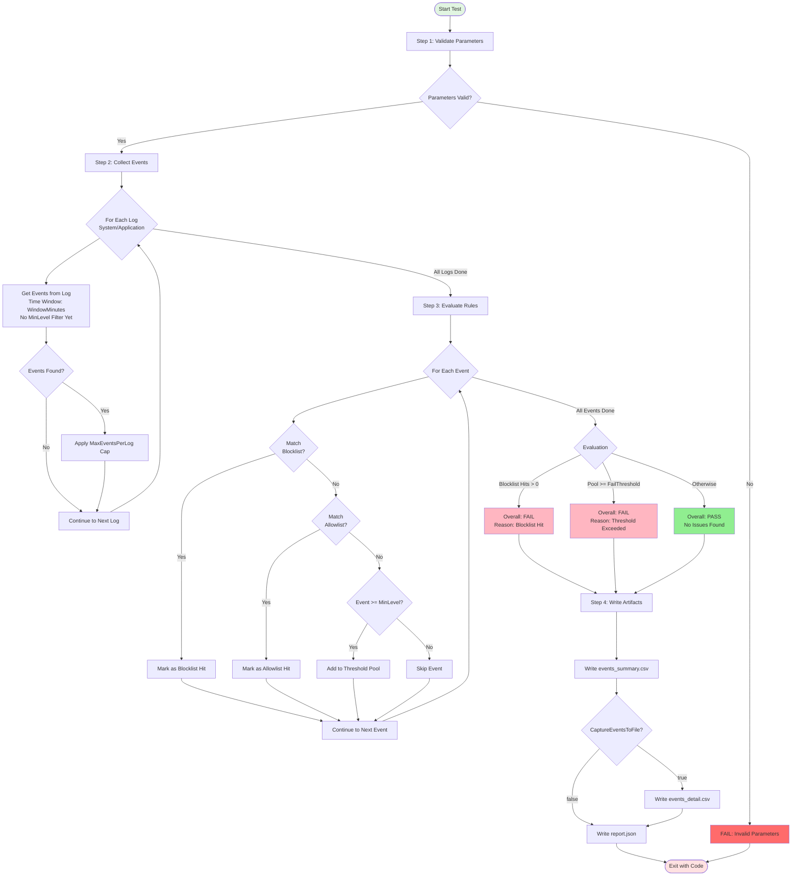

# Event View Check

## Purpose
Validate PC stability and health by checking Windows **System** and **Application** Event Logs within a relative time window. The test fails immediately on **Blocklist** matches, or fails when the remaining event count (after Allowlist exclusion) exceeds a simple threshold.

## Test Flow



## Test Logic
1. Read **ALL** events from `System` and `Application` within the last `WindowMinutes` (no level filtering yet).
2. Evaluate rules with priority:
   - **Blocklist first**: any match causes **FAIL** (checks all collected events).
   - **Allowlist next**: matching events are excluded from threshold counting (checks all collected events).
3. Apply `MinLevel` filter **only to threshold pool**: remaining events below `MinLevel` are not counted toward threshold.
4. Count the threshold pool. If `poolCount >= FailThreshold`, the test **FAILS**; otherwise **PASS**.
5. Always write `artifacts/report.json` and `artifacts/events_summary.csv`. Optionally write `artifacts/events_detail.csv`.

## Parameters
- **WindowMinutes**: Lookback window in minutes.
- **LogNames**: JSON array of logs to query. Only `["System","Application"]` is supported.
- **MinLevel**: Minimum severity to include (`Critical`, `Error`, `Warning`, `Information`, `None`).
- **AllowlistCsv**: Allowlist rules CSV path (relative to the test case directory by default).
- **BlocklistCsv**: Blocklist rules CSV path (relative to the test case directory by default).
- **FailThreshold**: Fail if the threshold pool count is >= this value.
- **MaxEventsPerLog**: Maximum number of events read per log.
- **TruncateMessageChars**: Max message length written to outputs (0 = no truncation).
- **CaptureEventsToFile**: `Enable` writes `artifacts/events_detail.csv` with per-event details.

## Rule Files (Allowlist/Blocklist CSV)

Both allowlist and blocklist rules use the same CSV format with the following columns:

| Column | Required | Description |
|--------|----------|-------------|
| `rule_id` | No | Unique identifier for the rule (for tracking which rule matched) |
| `owner` | No | Owner/team responsible for the rule |
| `comment` | No | Description or reason for the rule |
| `log` | No | Log name to match (`System` or `Application`). **Exact match**, case-insensitive. |
| `provider` | No | Event provider name to match. **Exact match**, case-insensitive. **Important**: Use the full PowerShell provider name (e.g., `Microsoft-Windows-Kernel-General`), not the Event Viewer display name (e.g., `Kernel-General`). |
| `event_id` | No | Event ID number to match. **Exact match**. |
| `level` | No | Event level to match (`Critical`, `Error`, `Warning`, `Information`). **Exact match**, case-insensitive. |
| `message` | No | Text to search in the event message. |
| `match_mode` | No | How to match `message` field only: `contains` (default), `exact`, or `regex`. |

### Rule Matching Logic
- **AND semantics**: All non-empty columns in a rule must match for the rule to apply
- Empty/blank columns are ignored (act as wildcards)
- **Field matching modes**:
  - `log`, `provider`, `event_id`, `level`: **Exact match only** (case-insensitive for text fields)
  - `message`: Supports `contains` (default), `exact`, or `regex` via `match_mode` column
- **Provider name**: Must use the full PowerShell provider name returned by `Get-WinEvent`
  - ❌ Wrong: `Kernel-General` (Event Viewer display name)
  - ✅ Correct: `Microsoft-Windows-Kernel-General` (PowerShell ProviderName)
  - To find the correct name: `Get-WinEvent -LogName System -MaxEvents 1 | Select-Object ProviderName`
- First matching rule wins (rules are evaluated in order)

### Example: blocklist.csv
```csv
rule_id,owner,comment,log,provider,event_id,level,message,match_mode
BL001,OpsTeam,Kernel time change,System,Microsoft-Windows-Kernel-General,16,Information,,
BL002,SecTeam,Security audit failure,Security,Microsoft-Windows-Security-Auditing,4625,Warning,,
BL003,OpsTeam,Critical disk failure,System,,,Error,failed,contains
```

### Example: allowlist.csv
```csv
rule_id,owner,comment,log,provider,event_id,level,message,match_mode
AL001,DevTeam,Known VSCode restart,Application,VSCode,1001,Warning,normal shutdown,contains
AL002,NetTeam,Expected network timeout,System,,1014,Warning,timeout,regex
```

### Rule Priority
1. **Blocklist checked first**: Any match causes immediate FAIL
2. **Allowlist checked second**: Matched events are excluded from threshold counting
3. **Remaining events**: Go into threshold pool and counted against `FailThreshold`

## How to Run Manually
From the case directory:
```powershell
pwsh -File .\run.ps1
```

Override parameters (example):
```powershell
pwsh -File .\run.ps1 -WindowMinutes 120 -MinLevel Error -FailThreshold 5 -CaptureEventsToFile Enable
```

## Expected Result
- **PASS (exit 0)**: No Blocklist match and `threshold_pool_count < FailThreshold`.
- **FAIL (exit 1)**: Any Blocklist match, or `threshold_pool_count >= FailThreshold`.
- **ERROR (exit >= 2)**: Script/environment error (e.g., invalid parameters, CSV parse error).
Artifacts are written to `artifacts/`:
- `report.json` (required)
- `events_summary.csv` (always)
- `events_detail.csv` (only when `CaptureEventsToFile=Enable`)
